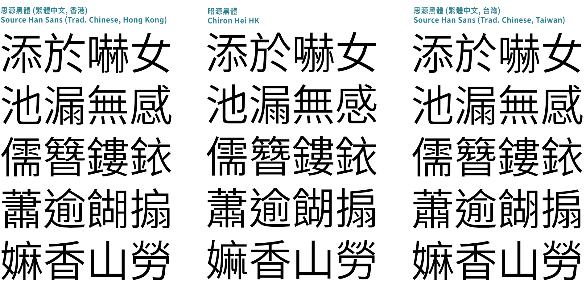
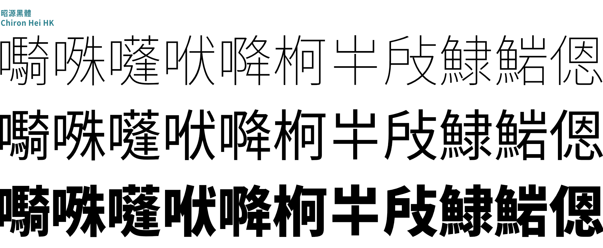
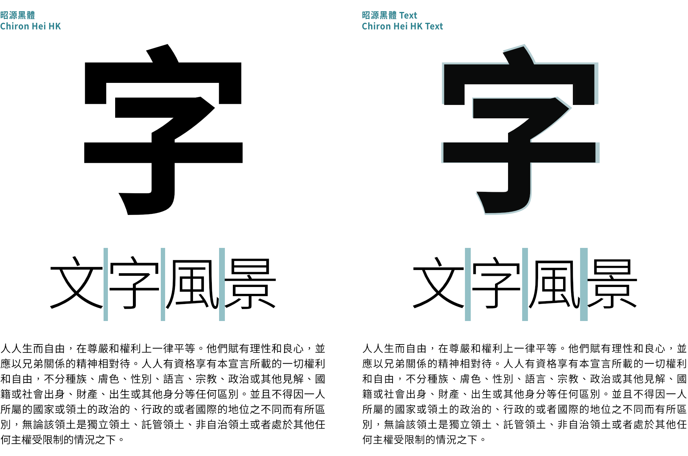
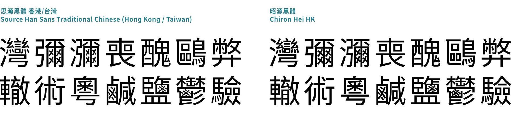

昭源黑體 Chiron Hei HK
=======================

English 英文　　[Chinese 中文](README.md)

## About this Font

Chiron Hei HK (昭源黑體) is a Traditional Chinese sans-serif typeface based on [Adobe](https://adobe.com/)’s [Source Han Sans](https://github.com/adobe-fonts/source-han-sans) (a.k.a. [Google](https://www.google.com)’s [Noto Sans CJK](https://github.com/googlefonts/noto-cjk/)). The original typeface is based on the [Reference Glyphs for Chinese Computer Systems in Hong Kong](https://www.ccli.gov.hk/en/download/reference_glyphs.html) published by the Chinese Language Interface Advisory Committee (CLIAC) in 2016. The glyph shape resembles the strokes in handwritten Chinese characters, which may not be all suitable for screen and printing.

In Chiron Hei HK, glyph shapes in Source Han Sans Traditional Chinese (Hong Kong) are reviewed and adjusted for the better display effect on screen and in print. The font takes references from the glyph shapes of typefaces commonly seen in daily life to provide a set of regional agnostic, modern-style glyphs that balance standard glyph shapes and the usual stroke forms of printed typefaces. The glyph set is similar to the prevailing, usually commercial, typefaces in the Traditional Chinese communities. 

Also check out [Chiron Sung HK](https://github.com/chiron-fonts/chiron-sung-hk/), the complementary serif typeface for Chiron Hei HK.

As this font is designed for Traditional Chinese users, the [website](https://chiron-fonts.github.io/) and the [CHANGELOG](CHANGELOG.md) details are available in Chinese only. This README provides an introductory guide to the font’s features and usage in English. 

## Usage

### For desktop

Download the font from the [Github Releases](https://github.com/chiron-fonts/chiron-hei-hk/releases/latest) page and install it. The font comes with various configurations:
 
* TrueType format, static instances (`TTF/` directory)
* OpenType format, static instances (`OTF/` directory)
* Variable Font in TrueType or OpenType format (`VAR/` directory)
* Webfont version in OpenType WOFF2 format (`WOFF2_OTF/` directory)
* Webfont version in TrueType WOFF2 format (`WOFF2_TTF/` directory)

The font family name is *Chiron Hei HK* for static instances, and *Chiron Hei HK VF* for the variable font configuration. Use the *Chiron Sung HK WS* font family name for the webfont version (see below).

### For web

In addition to downloading manually through the Github releases page, there are two alternative ways to access the webfont version of Chiron Hei HK.

#### 1. Self-hosting

You may self-host the webfont version by installing the corresponding [npm package](https://www.npmjs.com/package/chiron-hei-hk-webfont) and import the CSS files. For example: 

```css
@import '~chiron-hei-hk-webfont/css/vf.css';
@import '~chiron-hei-hk-webfont/css/vf-italic.css';
```

For TrueType outline, install the [chiron-hei-hk-webfont-truetype npm package](https://www.npmjs.com/package/chiron-hei-hk-webfont-truetype) instead, and change the import module name from `chiron-hei-hk-webfont` to `chiron-hei-hk-webfont-truetype`.

#### 2. CDN

Visit the font package page in jsDelivr ([OpenType](https://www.jsdelivr.com/package/npm/chiron-hei-hk-webfont?path=css) / [TrueType](https://www.jsdelivr.com/package/npm/chiron-hei-hk-webfont-truetype?path=css)), add the desired font styles to the collection, and retrieve the CSS import statements. *Note: do not use the option that merges all the selected styles into a single file. This will not work.* 

Usage example:

```css
body {
    font-family: "Chiron Hei HK WS"; /* Note the font name. */
    font-weight: 310; /* Any number between 250 and 900. */
    font-style: normal; /* normal or italic. */
    font-variation-settings: "PADG" 4; /* Any number between 0 and 10. */
}
```

## Compare to the upstream 

Chiron Hei HK is based on the Traditional Chinese (Hong Kong) variant of Source Han Sans *(the upstream)*. Here’s a comparison to illustrate the features of Chiron Hei HK:

### Glyph shapes



Glyphs of Big Five and HKSCS-2016 character sets for Source Han Sans Traditional Chinese (Hong Kong) are designed mostly in accordance with the [Reference Glyphs for Chinese Computer Systems in Hong Kong
](https://www.ccli.gov.hk/en/download/reference_glyphs.html). In my opinion it is a little too fastidious about asking the printed form of a character to follow how it is written by hand.

Chiron Hei HK takes references from the commercial typefaces commonly seen in Hong Kong, which emphasizes overall aesthetics for printing and display. While Chiron Hei HK doesn’t strictly adhere to a single standard (de facto or not), its chosen glyph form is widely recognized by the Traditional Chinese community.

Over 7,000 glyphs have been remapped or modified as of this writing. Check out [UpstreamDifferences.pdf](resources/UpstreamDifferences.pdf) for details on changes (Section 1 and 3 for remapped glyphs and section 2 and 4 for redesigned glyphs).

### `locl` GSUB feature

Chiron Hei HK covers all codepoints in the **language-specific** configuration of Source Han Sans Traditional Chinese (Hong Kong). However, it does not support the `locl` (localized forms) feature of the original typeface. Only the default, opinionated set of glyph shapes will be available. Glyphs specific to other regions are removed.

### Full-width punctuations adjustment

* Full-width punctuation shapes have been slightly adjusted.
* `‘`, `’`, `“` and `”` now default to their proportional version as `「`, `」`, `『` and `』` are used for Chinese quotes in Traditional Chinese environment      
* Full-width version of `⸺` (U+2E3A) and `⸻` (U+2E3B) are provided by default.
* Removed the `halt` `vhal` `palt` `vpal` Opentype instructions for full-width punctuations. Shrinking the advance widths is not recommended for these characters in Traditional Chinese environment.

### Character additions (Chinese)



Over a thousand Chinese character glyphs have been added, including amendments after the publishing of HKSCS-2016.

Again, check out [UpstreamDifferences.pdf](resources/UpstreamDifferences.pdf) (Section 6) for details.

### LGC letters

The full set of [Source Sans 3](https://github.com/adobe-fonts/source-sans) has been incorporated. Note that the scaling factor of the LGC characters in Chiron Hei HK is different from the upstream, so it is not a drop-in replacement of the latter.

### Font weight and naming

The static font families, Chiron Hei HK and Chiron Hei HK Text, use abbreviated weight names for better compatibility with certain operating systems. The variable font version (Chiron Hei HK VF) uses the long weight names as its upstream.

| Chiron Hei HK/HK Text | Chiron Hei HK VF | Weight Axis Value |
|------------------------|-------------------|-------------------|
| EL                     | ExtraLight        | 250               |
| L                      | Light             | 300               |
| N                      | Normal            | 350               |
| R                      | Regular           | 400               |
| M                      | Medium            | 500               |
| SB                     | SemiBold          | 600               |
| B                      | Bold              | 700               |
| H                      | Heavy             | 900               |

Note that the “SemiBold” font weight is not present in the upstream.

### Additional Italic style

Source Han Sans does not have a true italic font configuration. Chiron Hei HK provides an italic style by slanting the original (non-LGC) glyphs and then incorporating the Source Sans italic typeface.

### Additional “PADG” axis (variable font only)

Chiron Hei HK introduces a new “PADG” axis alongside the original “wght” axis in the variable font. This “PADG” axis allows you to control the type face area decrement of Han/Kanji characters. A positive value will shrink the character size without changing the advance width, bringing more space between Chinese characters. This can be useful for body text typesetting in print. 

The value can be any integer between 0 and 10. 0 means zero decrement, and setting it to 10 will shrink the character size by approximately 5%. 

### Additional “Text” subfamily



The “Text” subfamily is created by converting variable font instances with the `PADG` axis set to 6 into static instances. By moderately shrinking the Han/Kanji characters, the “Text” subfamily provides more space between Chinese characters, making it suitable for body text typesetting.

### Glyph optimization for Regular instance



Regular master has been added to a small number of frequently accessed characters.

## License

Chiron Hei HK is available under the OFL-1.1 License and can be used free of charge, for both commercial and non-commercial purposes. Refer to  [LICENSE.md](LICENSE.md) for details.

## Donation

Buy me a drink through [Paypal.me](https://www.paypal.com/paypalme/tamcyhk) if you are satisfied with my work.